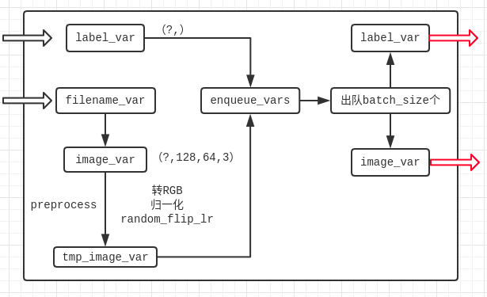
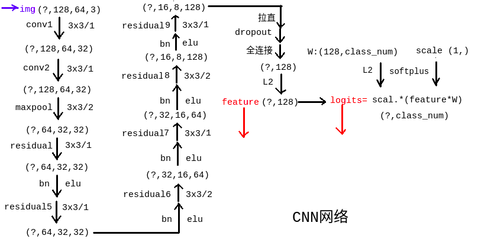
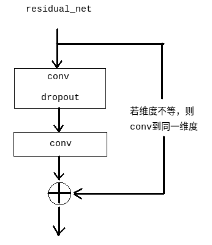
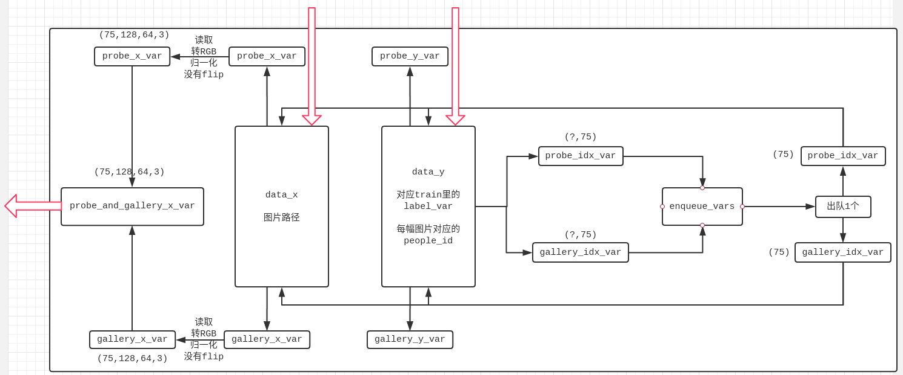
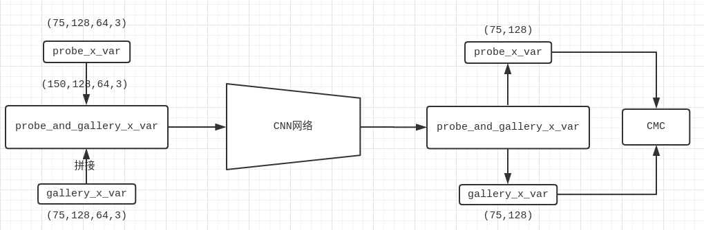

# Training on Market1501
## mode=train
- bounding_box_test文件夹 图片命名方式
  - 
  - people_id每个人的编号，同一个人在不同图像上的people_id一样
- [train_market1501](../train_market1501.py).read_train()
  - 获取所有数据的people_id
  - create_validation_split(people_id)
    - 对所有people_id**去重**
    - **去重后的people_id**按一定比例随机采样作为验证集，其余为训练集
    - 返回对应的索引
  - 返回训练集的people_id
- train_x:图片
- train_y:people_id
### train_loop
- [train_app](../train_app.py).create_trainer()
  - /cpu:0
  - 
  - image_var流向CNN网络
  - label_var、feature、logits流向loss

- CNN网络
  - 
  - 激活函数都是ELU
- 残差网络
  - 
- loss
  - cross_entropy_var(本论文的损失)
    - 计算"预处理流出的label_var"和"CNN网络流出的logits"的交叉熵
  - accuracy_var
    - "logits最大概率的类"和"label_var"计算得到精确度
  - magnet_loss(不是本论文的损失)
    - 计算"预处理流出的label_var"和"CNN网络流出的feature"的自定义损失
  - triplet_loss(不是本论文的损失)
    - 计算"预处理流出的label_var"和"CNN网络流出的feature"的自定义损失

## eval
- 获取验证集
  - 由于[train_market1501](../train_market1501.py).read_validation和read_train的随机种子一样，虽然train和eval不在同一个进程里，但得到的validation和train是刚好分割开的。
- create_network_factory里只有is_training参数不同
### eval_loop
- 创建num_galleries个random CMC galleries to average CMC top-k over
  - for i in range(num_galleries):
    - [util](../datasets/util.py).create_cmc_probe_and_gallery()
      - 随机种子固定
      - for y in unique_y:#对每个不同的人
        - idx_1:从随机选取的一个摄像头拍摄的id为当前y的人的图像索引中随机选取一个
        - idx_2:从随机选取的一个摄像头拍摄的id为当前y的人的图像索引中随机选取一个
        - probe_indices.append(i1)#列表保存 每个人在随机相机的一张随机图索引
        - gallery_indices.append(i2)#列表保存 每个人在另一个随机相机的一张随机图索引
      - 返回probe_indices,gallery_indices
    - probes.append(probe_indices)#列表 **保存num_galleries个 存放每个人在随机相机的一张随机图索引的列表**
    - galleries.append(gallery_indices)#列表 **保存num_galleries个 存放每个人在另一个随机相机的一张随机图索引的列表**
- [train_app](../train_app.py).eval_loop()
  - 
  - CMC
    - 
  - evaluate
- CMC曲线
  - [metrics](../metrics.py).recognition_rate_at_k()
    - label_mat:probs_x中与gallery_x最相近的k个gallery_y值是否与prob_y相等
    - 返回 num_correct/min(k,num_relevant)
      - num_correct:the fraction of images in the top k entries of the ranked gallery that have the same label as the probe 
      - num_relevant:the total number of elements in the gallery that have the same label.代码中这里一直是1
  - top1识别率表示按照某种相似度匹配规则匹配后，第一次就能判断出正确的标签的数目与总的测试样本数目之比
  - top5识别率指前五项（按照匹配程度从大到小排列后）有正确匹配的个数与总的测试样本数目之比。


# code tips
- def arg_scope(list_ops_or_scope, **kwargs):
  - 向参数添加默认参数
  - Eg:[factory_fn](../nets/deep_sort/network_definition.py)
- 多进程且进程安全地train
  - [queued_trainer](../queued_trainer.py).run()
  - [ ] 生成器生成训练样本
  - [ ] session
  - _run_enqueue_thread()
    - ```
        feed_dict = {
          var: value for var, value in
            zip(self._input_vars, data)}
        session.run(self._enqueue_op, feed_dict=feed_dict)
      ```
    - ```
      self._enqueue_op = self._queue.enqueue_many(self._enqueue_vars)
      ```
    - [train_app](../train_app.py)
      - 训练时enqueue_var为[random_flip_lr后的图像,label_var]
        - trainer = queued_trainer.QueuedTrainer(enqueue_vars, input_vars)
          - 这里的enqueue_vars是[对input_vars转RGB->归一化->random_flip_lr后的值,label_var]
      - eval时enqueue_var为[原图像,label_var]
        - trainer = queued_trainer.QueuedTrainer([probe_idx_var, gallery_idx_var])
          - 只有enqueue_vars，没有input_var
- vscode lanch.json单个进程的环境变量修改
  - command
    - ```
      CUDA_VISIBLE_DEVICES="" python train_market1501.py \
          --mode=eval \
          --dataset_dir=/home/staillyd/DataSets/Market1501/Market-1501-v15.09.15/ \
          --loss_mode=cosine-softmax \
          --log_dir=./output/market1501/ \
          --run_id=cosine-softmax \
          --eval_log_dir=./eval_output/market1501
      ```
  - launch.json
    - ```
      {
          "name": "CMC evaluation on validation set",
          "type": "python",
          "request": "launch",
          "program": "${workspaceFolder}/train_market1501.py",
          "console": "integratedTerminal",
          "args": [
              "--mode=eval",
              "--dataset_dir=/home/staillyd/DataSets/Market1501/Market-1501-v15.09.15/",
              "--loss_mode=cosine-softmax",
              "--log_dir=./output/market1501/",
              "--run_id=cosine-softmax",
              "--eval_log_dir=./eval_output/market1501"
          ],
          "env":{"CUDA_VISIBLE_DEVICES":""}
      }
      ```