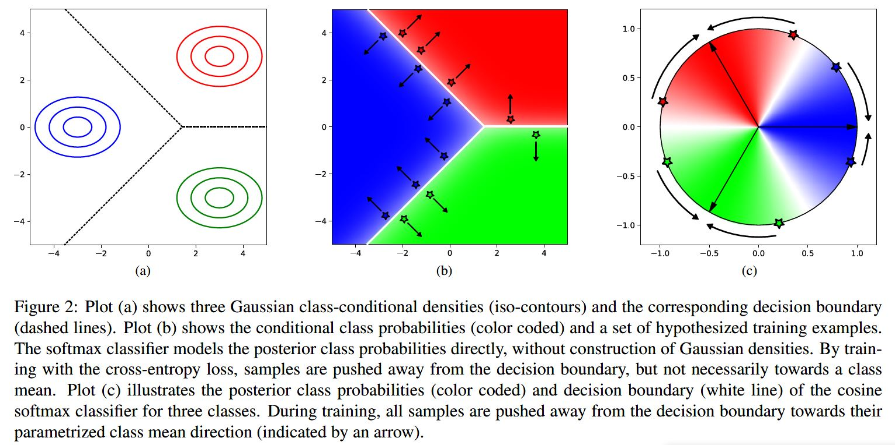

# cosine_metric_learning论文笔记
[参考翻译](https://blog.csdn.net/TYUT_xiaoming/article/details/99773097)
- 度量学习
  - 从相同Person 提取的两个特征可能比来自不同Person提取的特征更接近
  - 深度度量学习将相似性概念直接编码到训练目标中
- Standard Softmax Classifier
  - 
  - 
  - 
    - a:样本分布和相应的决策边界
    - b:softmax分类器通过训练交叉熵损失，样本从决策边界被推离，但不一定朝向类平均值
    - c:Cosine Softmax Classifier，所有样本从决策边界推向其参数化的类平均方向
- Cosine Softmax Classifier
  - 
    - $\kappa$是自由缩放参数
  - 
    - a:$\kappa$小，样本分类集中
    - b:$\kappa$大，样本分类相对分散
  - 通过使权重衰减规范化，可以强制实施不同类别样本之间的差距。
- CNN网络
  - 
  - 所有卷积大小为3×3，最大池化由步幅2的卷积代替
  - ??当特征图的空间分辨率降低时，则相应地增加通道的数量以避免瓶颈
  - 所有激活函数为ELU
    - 

